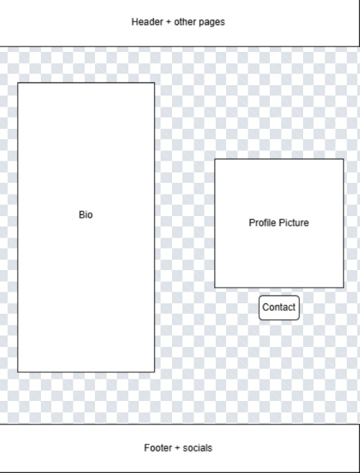
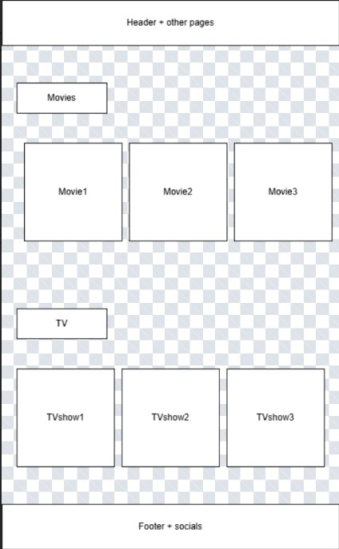
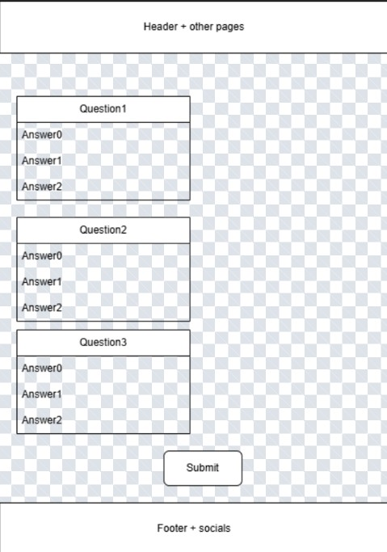

# Project 1: Alptug's Digital Ecosystem - Design Document

**Author:** Alptug Guven
**Course:** CS 5610 Web Development
**Date:** January 2026

---

## 1. Project Description

**"The Central Hub for All Things Alptug."**

This project is a curated "digital ecosystem" designed to centralize my online presence. It serves as a bridge between my professional identity and my personal interests. Rather than a standard static resume, it is a living hub where visitors can connect with me, understand my current philosophy, and engage with my creative tastes.

**Goals:**
* **Centralization:** To aggregate my disparate online identities (LinkedIn, Bluesky, GitHub) into one cohesive "Home."
* **Personality:** To showcase the human side of the developer through the "About Me" blurb and "Media Hub."
* **Interactivity:** To demonstrate technical competence through the "Up2 Quiz" and dynamic CSS interactions.

---

## 2. Site Architecture (3 Pages)

The website is structured into three distinct pillars:
1. **Homepage (index.html):** The landing page featuring my "About Me" personal blurb, quote philosophy, and direct access to my professional networks (LinkedIn, Bluesky, GitHub) and email.
2. **Media Hub (media.html):** A visual grid of my favorite Movies, TV Shows, and Anime, featuring interactive hover-states ("House-on mouse") for personal reviews.
3. **Up2 Quiz (quiz.html):** An interactive JavaScript-powered compatibility test for visitors to see if they match my "vibe."

---

## 3. User Personas

### Persona 1: Alfred (The Former Classmate)
* **Role:** An ambitious peer from a previous degree who has lost touch.
* **Motivation:** Alfred remembers Alptug as "that smart guy" but wants to know what he is up to now. He isn't looking for a resume; he wants the life update.
* **Behavior:** He reads the **"About Me"** blurb to see your current status and clicks the **LinkedIn** icon in the footer to connect professionally.
* **User Story:** > "As **Alfred**, I want to **read the personal blurb on the homepage**, so that I can **catch up on Alptug's current academic and life focus.**"

### Persona 2: Gianna (The "Vibe Check")
* **Role:** A new social connection or potential date.
* **Motivation:** Gianna met Alptug briefly and is doing a "background check" to see if there are any red flags. She isn't interested in coding skills; she wants to know his personality.
* **Behavior:** She skips the text and goes straight to the **Media Hub** to judge his taste in anime and takes the **Quiz** to see if they are compatible.
* **User Story:** > "As **Gianna**, I want to **hover over the movie posters**, so that I can **read Alptug's personal reviews and judge his taste in cinema.**"

### Persona 3: Ahmet (The Distant Relative)
* **Role:** An older family member living abroad.
* **Motivation:** He wants to feel connected to the family and needs a simple way to reach out.
* **Behavior:** He struggles with small tech. He needs a mobile-friendly layout and a big **Contact button**.
* **User Story:** > "As **Ahmet**, I want to **click the 'Contact Me' button**, so that I can **open an email draft immediately without having to copy-paste an address.**"

---

## 4. Technical & Design Decisions

### **The "Van Gogh" Palette**
I chose a high-contrast theme based on Vincent van Gogh's *Starry Night*:
* **Midnight Blue (#0b0d17):** Represents depth and professionalism (Backgrounds).
* **Sunflower Yellow (#f1c40f):** Represents energy and creativity (Highlights/Buttons).
* **Azure (#1abc9c):** Represents calm and clarity (Accents).

### **Fair Use Statement**
This website features posters of movies, TV shows, and anime (e.g., *Logan*, *One Piece*).
* **Context:** These images are used solely for educational and critical commentary purposes within a non-commercial personal portfolio.
* **Justification:** This falls under "Fair Use" as it is transformative (providing personal reviews/commentary) and does not impede the commercial market for the original works.

---

## 5. Wireframes (Mockups and Final)

*(Note: These are screenshots of the final responsive design.)*

**Homepage Layout:**
* Features a clear hero section, "About Me" text, and a sticky footer for social links.
* Mockup: 
* FINAL: 

**Media Hub Grid:**
* Uses CSS Grid to stack posters responsively, moving from 1 column (mobile) to 4 columns (desktop).
* Mockup: 
* FINAL:  

**Up2 Quiz Interface:**
* A clean, interactive form layout that calculates compatibility scores using JavaScript (ES6 Modules).
* Mockup: 
* FINAL: 