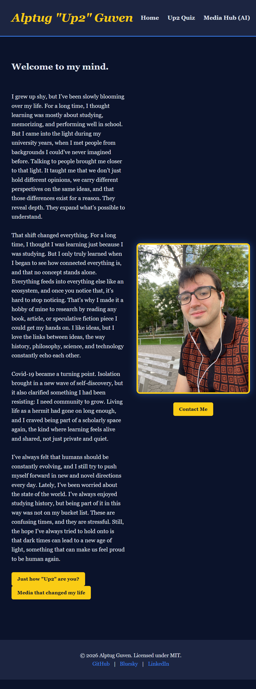
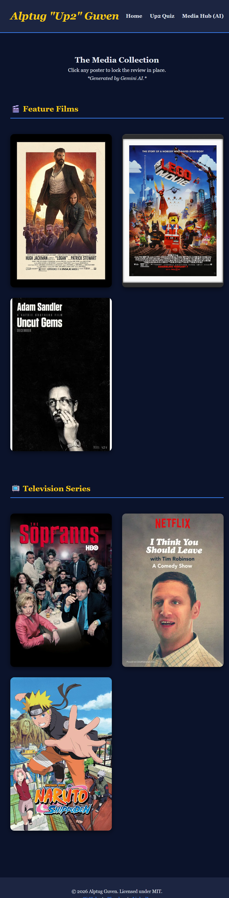
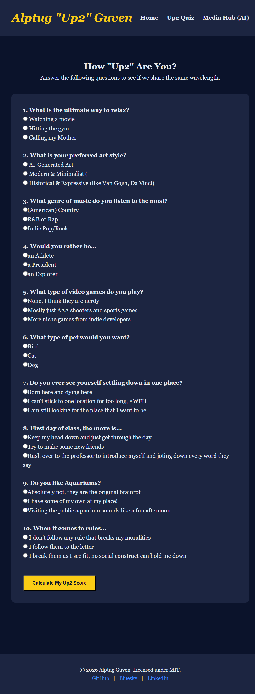

# 🌌 Alptug's Personal Homepage


> **"A centralized hub connecting my professional identity with my personal philosophy."**

## 👤 Author Information
* **Author:** Alptug Guven
* **Course:** [CS 5610 Web Development (Spring 2026)](https://johnguerra.co/classes/webDevelopment_online_spring_2026/)
* **University:** Northeastern University
* **📩 Contact:** alptug.guven24@gmail.com

## 🔗 Quick Links
* **🚀 Live Website:** [CLICK HERE TO VISIT](https://alptugguven24-ctrl.github.io/alptug-personal-site/)
* **🎥 Video Demonstration:** [[VIDEO LINK](https://youtu.be/7eyJTRhtIQc)]
* **📄 Design Document:** [View PDF/Markdown](./DESIGN.md)

---

## 🎯 Project Objective
This project marks my entry into full-stack engineering. The objective was to build a **responsive, multi-page personal website** from scratch without relying on heavy frameworks like Bootstrap or jQuery.

**Key Goals:**
1.  **First-Time Build:** As my first HTML/CSS/JS project, I focused on mastering the fundamentals: Semantic HTML, the CSS Box Model, and Vanilla JavaScript.
2.  **Centralization:** Creating a "Digital Ecosystem" that bridges the gap between my professional portfolio and my personal interests (Cinema, Aquariums).
3.  **Mobile-First:** Ensuring the site looks perfect on a phone before scaling up to desktop screens.

---

## 📸 Screenshots

### Desktop View (The "Van Gogh" Theme)
*Featured: The Homepage using the Midnight Blue & Sunflower Yellow palette.*


### Media Hub (Interactive Grid)
*Featured: The "House-on-Mouse" hover effect revealing reviews.*


### The "Up2" Quiz (JavaScript)
*Featured: The compatibility calculator logic.*


---

## 🛠️ Instructions to Build & Run
Since this is a static site with no backend dependencies, it is lightweight and easy to run.

### Prerequisites
* A modern web browser (Chrome, Firefox, Safari).
* VS Code (recommended).

### Steps
1.  **Clone the Repository:**
    ```bash
    git clone [https://github.com/alptugguven24-ctrl/alptug-personal-site.git](https://github.com/alptugguven24-ctrl/alptug-personal-site.git)
    ```
2.  **Open in VS Code:**
    ```bash
    cd alptug-personal-site
    code .
    ```
3.  **Launch Live Server:**
    * Install the **Live Server** extension in VS Code.
    * Open `index.html`.
    * Click "Go Live" in the bottom right corner.
4.  **View:** The site will launch at `http://127.0.0.1:5500/`.

---

## ✨ Key Features & Creative Components

### 1. The Media Hub (CSS Grid & Hover States)
Instead of a boring list, I built a visual grid of movie posters.
* **Tech:** Uses **CSS Grid** to handle responsive layout (1 column on mobile -> 4 columns on desktop).
* **Creative Element:** Implemented a **"House-on-Mouse"** effect using CSS Transitions. Hovering over a poster dims the image and slides up a custom review overlay.

### 2. The "Up2" Compatibility Quiz (ES6 Modules)
A custom-built JavaScript application to test user compatibility.
* **Tech:** Built with **ES6 Modules** (`import/export`) to keep code clean.
* **Logic:** Uses the `FormData` API to capture inputs dynamically, calculating a percentage score without hard-coded conditional chains.

### 3. Mobile Responsiveness
* The navigation bar transforms into a touch-friendly stack on mobile devices.
* Font sizes and padding adjust dynamically using CSS Media Queries (`@media (max-width: 768px)`).

---

## 🔌 Development Tools Used
To maintain high code quality, I utilized the following VS Code extensions:
* **ESLint:** To enforce strict JavaScript syntax and catch errors early.
* **Prettier:** To ensure consistent indentation and formatting.
* **Live Server:** For real-time DOM updates.
* **W3C Validator:** Used to verify semantic markup.

---

## ⚖️ Legal & Fair Use Statement

### Image Attribution
This website features posters of copyrighted motion pictures and anime series (e.g., *Logan*, *One Piece*, *Naruto*).

### Fair Use Defense
In accordance with **Section 107 of the U.S. Copyright Act**, the use of these images constitutes **Fair Use** for the following reasons:
1.  **Educational Purpose:** The use is non-commercial and serves as a strictly educational portfolio project for CS 5610.
2.  **Transformativeness:** The images are accompanied by original critical commentary and personal reviews, transforming the original context of the work.
3.  **No Market Harm:** This personal project does not compete with the original works or impede their commercial market.

---

## 🤖 GenAI Disclosure
In accordance with course policy, the use of Generative AI is disclosed below:

* **Tool:** Google Gemini (Jan 2026)
* **Usage:**
    1.  **Brainstorming:** Used to generate ideas for the "Van Gogh" color palette hex codes.
    2.  **CSS Logic:** Used to help troubleshoot the `z-index` stacking context for the Media Hub hover overlay.
    3.  **FS Engineer Roleplay:** Generated responses to my prompts roleplaying as a developer, asked for guidelines instead of code.
* 

---
*© 2026 Alptug Guven. Built for CS 5610.*